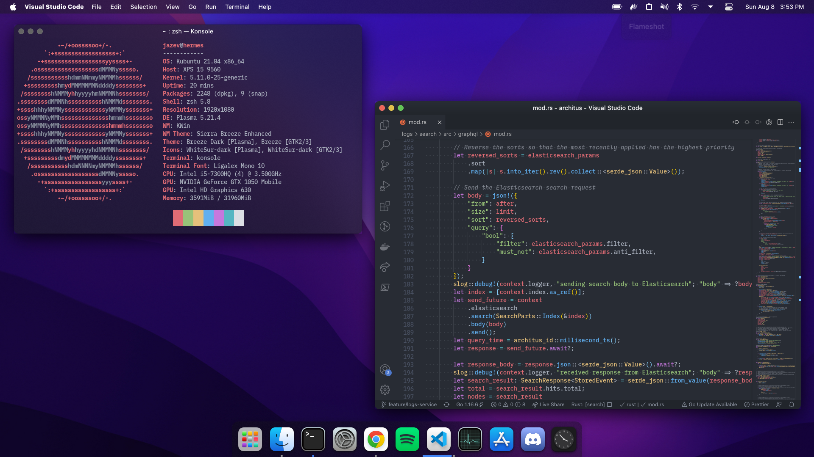

<h1></h1>

> These dotfiles/installation scripts can be used to set up a development system that emulates the macOS desktop dark theme.



## 🚀 Installing theme

To install the theming, an automated script was developed that works with a fresh install of Kubuntu 21.04 as of 08-08-2021. Once downloaded or cloned, run:

```sh
./automation/install-theme.sh
```

It will likely prompt for a password at the start, but should be able to run entirely unattended other than that. Once finished, reboot to fully apply all changes.

## 📃 Other notes/scripts

Other than the core theming script, a couple other scripts/instructions are in this repo:

- `./automation/install-apps.sh` automatically installs a variety of apps that I use on a daily basis
- `./automation/install-settings.sh` automatically configures some misc. KDE settings that I prefer
` ./notes/install.md` includes some notes for other steps I go through when installing
